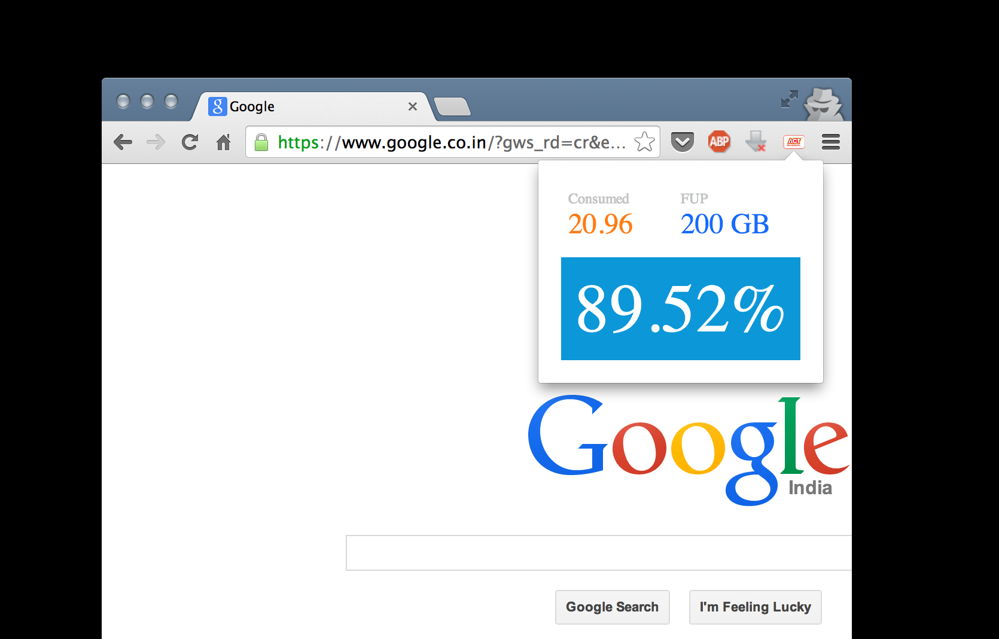

ACT Broadband Usage Monitor
---

Shows your ACT Broadband data usage (Bangalore currently).

Based on 'airtel-chrome-extension' by Rakesh Pai.
https://github.com/rakeshpai/airtel-chrome-extension

Built during Hasgeek Newyear 2014 Hacknight by Mrinmoy Das and Anenth Guru.

Installation
---

1.
   [Download the zip](https://github.com/anenthg/act-chrome-extension/archive/master.zip)
   and extract it into a suitable folder on your hard drive.
2. Type in `chrome://extensions` in your address bar in Google Chrome.
3. Check the "Developer mode" checkbox at the top right of the page.
4. Click the "Load unpacked extension..." button, and select the folder that you
   created in the first step.
5. That's it! You should see a new ACT logo next to your Chrome address bar.
   Click it to see details about your data usage.

License
---
MIT

Preview
---

